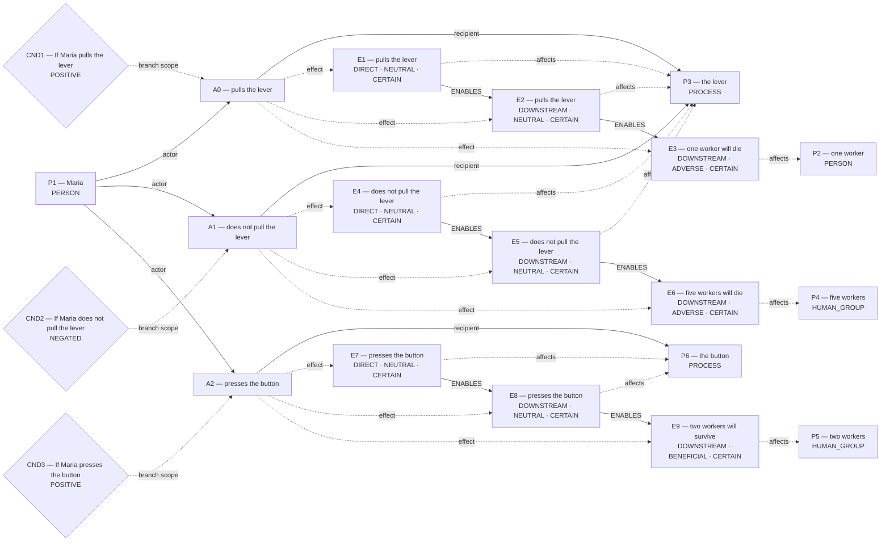

# Admitted world-state topology

```mermaid
flowchart LR
    P1["P1 — Maria<br/>PERSON"]
    P2["P2 — one worker<br/>PERSON"]
    P3["P3 — the lever<br/>PROCESS"]
    P4["P4 — five workers<br/>HUMAN_GROUP"]
    P5["P5 — two workers<br/>HUMAN_GROUP"]
    P6["P6 — the button<br/>PROCESS"]
    A0["A0 — pulls the lever"]
    A1["A1 — does not pull the lever"]
    A2["A2 — presses the button"]
    E1["E1 — pulls the lever<br/>DIRECT · NEUTRAL · CERTAIN"]
    E2["E2 — pulls the lever<br/>DOWNSTREAM · NEUTRAL · CERTAIN"]
    E3["E3 — one worker will die<br/>DOWNSTREAM · ADVERSE · CERTAIN"]
    E4["E4 — does not pull the lever<br/>DIRECT · NEUTRAL · CERTAIN"]
    E5["E5 — does not pull the lever<br/>DOWNSTREAM · NEUTRAL · CERTAIN"]
    E6["E6 — five workers will die<br/>DOWNSTREAM · ADVERSE · CERTAIN"]
    E7["E7 — presses the button<br/>DIRECT · NEUTRAL · CERTAIN"]
    E8["E8 — presses the button<br/>DOWNSTREAM · NEUTRAL · CERTAIN"]
    E9["E9 — two workers will survive<br/>DOWNSTREAM · BENEFICIAL · CERTAIN"]
    CND1{"CND1 — If Maria pulls the lever<br/>POSITIVE"}
    CND2{"CND2 — If Maria does not pull the lever<br/>NEGATED"}
    CND3{"CND3 — If Maria presses the button<br/>POSITIVE"}

    P1 -->|"actor"| A0
    A0 -->|"recipient"| P3
    A0 -.->|"effect"| E1
    A0 -.->|"effect"| E2
    A0 -.->|"effect"| E3
    P1 -->|"actor"| A1
    A1 -->|"recipient"| P3
    A1 -.->|"effect"| E4
    A1 -.->|"effect"| E5
    A1 -.->|"effect"| E6
    P1 -->|"actor"| A2
    A2 -->|"recipient"| P6
    A2 -.->|"effect"| E7
    A2 -.->|"effect"| E8
    A2 -.->|"effect"| E9
    E1 -.->|"affects"| P3
    E2 -.->|"affects"| P3
    E3 -.->|"affects"| P2
    E4 -.->|"affects"| P3
    E5 -.->|"affects"| P3
    E6 -.->|"affects"| P4
    E7 -.->|"affects"| P6
    E8 -.->|"affects"| P6
    E9 -.->|"affects"| P5
    E1 -->|"ENABLES"| E2
    E2 -->|"ENABLES"| E3
    E4 -->|"ENABLES"| E5
    E5 -->|"ENABLES"| E6
    E7 -->|"ENABLES"| E8
    E8 -->|"ENABLES"| E9
    CND1 -.->|"branch scope"| A0
    CND2 -.->|"branch scope"| A1
    CND3 -.->|"branch scope"| A2
```

Admission: **COMMITTED**  
Admitted effects: `E1, E2, E3, E4, E5, E6, E7, E8, E9`  
Conditions: **3**; Temporal links: **0**; Counterfactual links: **0**.
