# Logic_Puzzles claim/conflict projection

Read-only projection. Native records remain attributed; evidence links do not establish whole-record correctness.

```mermaid
flowchart LR
    n0["WORLD_EFFECT: pulls the lever"]
    n1["WORLD_EFFECT: pulls the lever"]
    n2["WORLD_EFFECT: one worker will die"]
    n3["WORLD_EFFECT: does not pull the lever"]
    n4["WORLD_EFFECT: does not pull the lever"]
    n5["WORLD_EFFECT: five workers will die"]
    n6["PROPOSITION: If Maria pulls the lever"]
    n7["PROPOSITION: If Maria does not pull the lever"]
    n8["PROPOSITION: pulls the lever; affected subject: the lever"]
    n9["PROPOSITION: pulls the lever; affected subject: the lever"]
    n10["PROPOSITION: one worker will die; affected subject: one worker"]
    n11["PROPOSITION: does not pull the lever; affected subject: the lever"]
    n12["PROPOSITION: does not pull the lever; affected subject: the lever"]
    n13["PROPOSITION: five workers will die; affected subject: five workers"]
    n14["PROPOSITION: five workers"]
    n15["PROPOSITION: one worker will die; affected subject: one worker"]
    n16["PROPOSITION: five workers will die; affected subject: five workers"]
    n17["PROPOSITION: one worker will die; affected subject: one worker"]
    n18["PROPOSITION: five workers will die; affected subject: five workers"]
    n19["PROPOSITION: If Maria pulls the lever"]
    n20["PROPOSITION: If Maria does not pull the lever"]
    n21["PROPOSITION: one worker will die; affected subject: one worker"]
    n22["PROPOSITION: five workers will die; affected subject: five workers"]
    n23["PROPOSITION: one worker will die; affected subject: one worker"]
    n24["PROPOSITION: five workers will die; affected subject: five workers"]
    n25["CLAIM: utilitarian: A0 assessment"]
    n26["CLAIM: utilitarian: A0 assessment"]
    n27["CLAIM: utilitarian: A0 assessment"]
    n28["CLAIM: utilitarian: A1 assessment"]
    n29["CLAIM: utilitarian: A1 assessment"]
    n30["CLAIM: utilitarian: A1 assessment"]
    n31["UNRESOLVED_CONFLICT: numeric reversal threshold lacks a scenario-grounded quantity"]
    n32["CLAIM: deontological: A0 PROHIBITED"]
    n33["FRAMEWORK_COMMITMENT: do not kill innocent person"]
    n34["FRAMEWORK_COMMITMENT: perfect negative duty overrides imperfect"]
    n35["CLAIM: deontological: A1 UNCERTAIN"]
    n36["UNRESOLVED_CONFLICT: one worker: do not kill innocent person ↔ five workers: duty to rescue five"]
    n37["UNRESOLVED_CONFLICT: A1 REQUIRED conflicts with governing PRIMARY relation CONSISTENT; committed as UNCERTAIN"]
    n38["CLAIM: care: A0 RESPONSIVE"]
    n39["FRAMEWORK_COMMITMENT: control of lever creates responsibility"]
    n40["FRAMEWORK_COMMITMENT: ACUTE_DEPENDENCY"]
    n41["CLAIM: care: A1 NEGLECTFUL"]
    n42["FRAMEWORK_COMMITMENT: ignoring control fails responsibility"]
    n43["UNRESOLVED_CONFLICT: A0 Care relation claims scenario grounding without a matching action effect"]
    n44["UNRESOLVED_CONFLICT: A0 competing Care claim remains contested"]
    n45["UNRESOLVED_CONFLICT: A1 competing Care claim remains contested"]
    n46["CLAIM: virtue: A0 EXEMPLIFIES"]
    n47["FRAMEWORK_COMMITMENT: PRACTICAL_WISDOM"]
    n48["CLAIM: virtue: A1 UNDERMINES"]
    n49["CLAIM: rawlsian: A0 assessment"]
    n50["FRAMEWORK_COMMITMENT: MAXIMIN_PRIMARY_GOODS"]
    n51["CLAIM: rawlsian: A1 assessment"]
    n52["UNRESOLVED_CONFLICT: framework map for does not pull the lever lacks framework-specific grounds"]
    n53["UNRESOLVED_CONFLICT: decisive numbers are not tied to the affected subject or Rawlsian position"]
    n54["UNRESOLVED_CONFLICT: A0 IMPROVES lacked directional support; committed as UNCERTAIN"]
    n55["UNRESOLVED_CONFLICT: A1 WORSENS lacked directional support; committed as UNCERTAIN"]
    n25 -->|"DEPENDENCY"| n15
    n25 -->|"DEPENDENCY"| n16
    n26 -->|"DEPENDENCY"| n15
    n26 -->|"DEPENDENCY"| n16
    n27 -->|"DEPENDENCY"| n15
    n27 -->|"DEPENDENCY"| n16
    n28 -->|"DEPENDENCY"| n15
    n28 -->|"DEPENDENCY"| n16
    n29 -->|"DEPENDENCY"| n15
    n29 -->|"DEPENDENCY"| n16
    n30 -->|"DEPENDENCY"| n15
    n30 -->|"DEPENDENCY"| n16
    n33 -->|"SUPPORT"| n32
    n34 -->|"SUPPORT"| n32
    n33 -->|"SUPPORT"| n35
    n34 -->|"SUPPORT"| n35
    n39 -->|"SUPPORT"| n38
    n40 -->|"SUPPORT"| n38
    n5 -->|"SUPPORT"| n41
    n42 -->|"SUPPORT"| n41
    n40 -->|"SUPPORT"| n41
    n46 -->|"DEPENDENCY"| n21
    n46 -->|"DEPENDENCY"| n22
    n47 -->|"SUPPORT"| n46
    n5 -->|"SUPPORT"| n48
    n48 -->|"DEPENDENCY"| n21
    n48 -->|"DEPENDENCY"| n22
    n47 -->|"SUPPORT"| n48
    n50 -->|"SUPPORT"| n49
    n50 -->|"SUPPORT"| n51
```

Proposed review queue (at most two issues):

- one worker: do not kill innocent person ↔ five workers: duty to rescue five
- numeric reversal threshold lacks a scenario-grounded quantity
