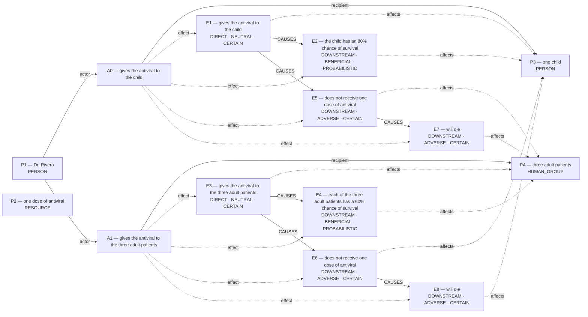

# Admitted world-state topology

```mermaid
flowchart LR
    P1["P1 — Dr. Rivera<br/>PERSON"]
    P2["P2 — one dose of antiviral<br/>RESOURCE"]
    P3["P3 — one child<br/>PERSON"]
    P4["P4 — three adult patients<br/>HUMAN_GROUP"]
    A0["A0 — gives the antiviral to the child"]
    A1["A1 — gives the antiviral to the three adult patients"]
    E1["E1 — gives the antiviral to the child<br/>DIRECT · NEUTRAL · CERTAIN"]
    E2["E2 — the child has an 80% chance of survival<br/>DOWNSTREAM · BENEFICIAL · PROBABILISTIC"]
    E3["E3 — gives the antiviral to the three adult patients<br/>DIRECT · NEUTRAL · CERTAIN"]
    E4["E4 — each of the three adult patients has a 60% chance of survival<br/>DOWNSTREAM · BENEFICIAL · PROBABILISTIC"]
    E5["E5 — does not receive one dose of antiviral<br/>DOWNSTREAM · ADVERSE · CERTAIN"]
    E6["E6 — does not receive one dose of antiviral<br/>DOWNSTREAM · ADVERSE · CERTAIN"]
    E7["E7 — will die<br/>DOWNSTREAM · ADVERSE · CERTAIN"]
    E8["E8 — will die<br/>DOWNSTREAM · ADVERSE · CERTAIN"]

    P1 -->|"actor"| A0
    A0 -->|"recipient"| P3
    A0 -.->|"effect"| E1
    A0 -.->|"effect"| E2
    A0 -.->|"effect"| E5
    A0 -.->|"effect"| E7
    P1 -->|"actor"| A1
    A1 -->|"recipient"| P4
    A1 -.->|"effect"| E3
    A1 -.->|"effect"| E4
    A1 -.->|"effect"| E6
    A1 -.->|"effect"| E8
    E1 -.->|"affects"| P3
    E2 -.->|"affects"| P3
    E3 -.->|"affects"| P4
    E4 -.->|"affects"| P4
    E5 -.->|"affects"| P4
    E6 -.->|"affects"| P3
    E7 -.->|"affects"| P4
    E8 -.->|"affects"| P3
    E1 -->|"CAUSES"| E2
    E3 -->|"CAUSES"| E4
    E5 -->|"CAUSES"| E7
    E6 -->|"CAUSES"| E8
    E1 -->|"CAUSES"| E5
    E3 -->|"CAUSES"| E6
```

Admission: **COMMITTED**  
Admitted effects: `E1, E2, E3, E4, E5, E6, E7, E8`  
Conditions: **0**; Temporal links: **0**; Counterfactual links: **0**.
