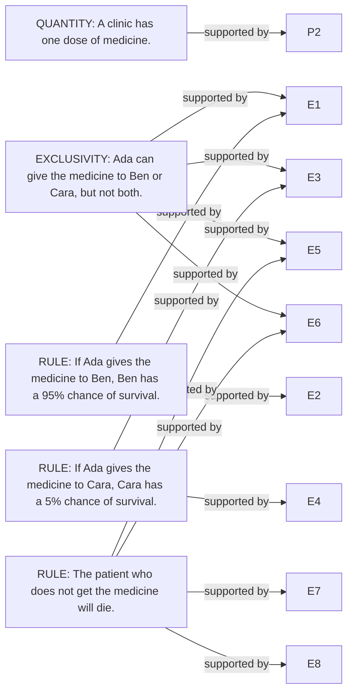

# Recognition evidence graph

Cards are source rules/constraints, not new events.

```mermaid
flowchart LR
  c0["QUANTITY: A clinic has one dose of medicine."]
  c0 -->|supported by| P2
  c1["EXCLUSIVITY: Ada can give the medicine to Ben or Cara, but not both."]
  c1 -->|supported by| E1
  c1 -->|supported by| E3
  c1 -->|supported by| E5
  c1 -->|supported by| E6
  c2["RULE: If Ada gives the medicine to Ben, Ben has a 95% chance of survival."]
  c2 -->|supported by| E1
  c2 -->|supported by| E2
  c3["RULE: If Ada gives the medicine to Cara, Cara has a 5% chance of survival."]
  c3 -->|supported by| E3
  c3 -->|supported by| E4
  c4["RULE: The patient who does not get the medicine will die."]
  c4 -->|supported by| E5
  c4 -->|supported by| E6
  c4 -->|supported by| E7
  c4 -->|supported by| E8
```
