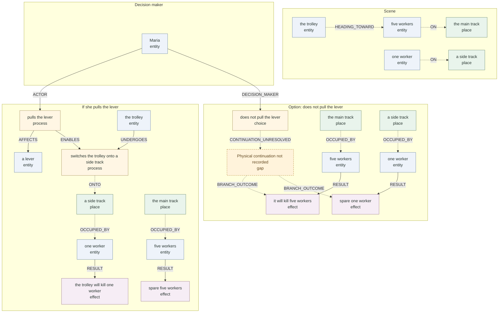

# World considered by the two live frameworks

Typed reader projection of their exact admitted world. Omission branch interpretation was also present in their prompts.

```mermaid
flowchart TB
  subgraph scene["Scene"]
    direction LR
    SC_P3["the trolley<br/>entity"]
    SC_P4["five workers<br/>entity"]
    SC_P7["the main track<br/>place"]
    SC_P2["one worker<br/>entity"]
    SC_P8["a side track<br/>place"]
  end
  subgraph branch_A0["If she pulls the lever"]
    direction LR
    A0["pulls the lever<br/>process"]
    E2["switches the trolley onto a side track<br/>process"]
    A0_P6["a lever<br/>entity"]
    A0_P3["the trolley<br/>entity"]
    A0_P8["a side track<br/>place"]
    A0_P2["one worker<br/>entity"]
    E3["the trolley will kill one worker<br/>effect"]
    A0_P4["five workers<br/>entity"]
    E4["spare five workers<br/>effect"]
    A0_P7["the main track<br/>place"]
  end
  subgraph branch_A1["Option: does not pull the lever"]
    direction LR
    A1["does not pull the lever<br/>choice"]
    A1_GAP["Physical continuation not recorded<br/>gap"]
    A1_P4["five workers<br/>entity"]
    E7["it will kill five workers<br/>effect"]
    A1_P7["the main track<br/>place"]
    A1_P2["one worker<br/>entity"]
    E8["spare one worker<br/>effect"]
    A1_P8["a side track<br/>place"]
  end
  subgraph actor["Decision maker"]
    direction LR
    ACT_P1["Maria<br/>entity"]
  end
  SC_P3 -.->|"HEADING_TOWARD"| SC_P4
  SC_P4 -.->|"ON"| SC_P7
  SC_P2 -.->|"ON"| SC_P8
  ACT_P1 -->|"ACTOR"| A0
  A0 -->|"AFFECTS"| A0_P6
  A0 -->|"ENABLES"| E2
  A0_P3 -->|"UNDERGOES"| E2
  E2 -.->|"ONTO"| A0_P8
  A0_P2 -->|"RESULT"| E3
  A0_P8 -.->|"OCCUPIED_BY"| A0_P2
  A0_P4 -->|"RESULT"| E4
  A0_P7 -.->|"OCCUPIED_BY"| A0_P4
  ACT_P1 -->|"DECISION_MAKER"| A1
  A1 -.->|"CONTINUATION_UNRESOLVED"| A1_GAP
  A1_P4 -->|"RESULT"| E7
  A1_P7 -.->|"OCCUPIED_BY"| A1_P4
  A1_GAP -.->|"BRANCH_OUTCOME"| E7
  A1_P2 -->|"RESULT"| E8
  A1_P8 -.->|"OCCUPIED_BY"| A1_P2
  A1_GAP -.->|"BRANCH_OUTCOME"| E8
  classDef sourceReading fill:#eef4fb,stroke:#46739a,color:#233b51
  classDef unresolved fill:#fff3db,stroke:#af7b26,stroke-dasharray:5 3,color:#60461e
  classDef reader_entity fill:#eef3fa,stroke:#64809e,color:#26332e
  class SC_P3,SC_P4,SC_P2,ACT_P1,A0_P6,A0_P3,A0_P2,A0_P4,A1_P4,A1_P2 reader_entity
  classDef reader_place fill:#e9f4ec,stroke:#60836a,color:#26332e
  class SC_P7,SC_P8,A0_P8,A0_P7,A1_P7,A1_P8 reader_place
  classDef reader_process fill:#fff6e4,stroke:#a18a56,color:#26332e
  class A0,E2 reader_process
  classDef reader_choice fill:#fff6e4,stroke:#a18a56,color:#26332e
  class A1 reader_choice
  classDef reader_effect fill:#f6edf5,stroke:#96738d,color:#26332e
  class E3,E4,E7,E8 reader_effect
  class A1_GAP unresolved
```
