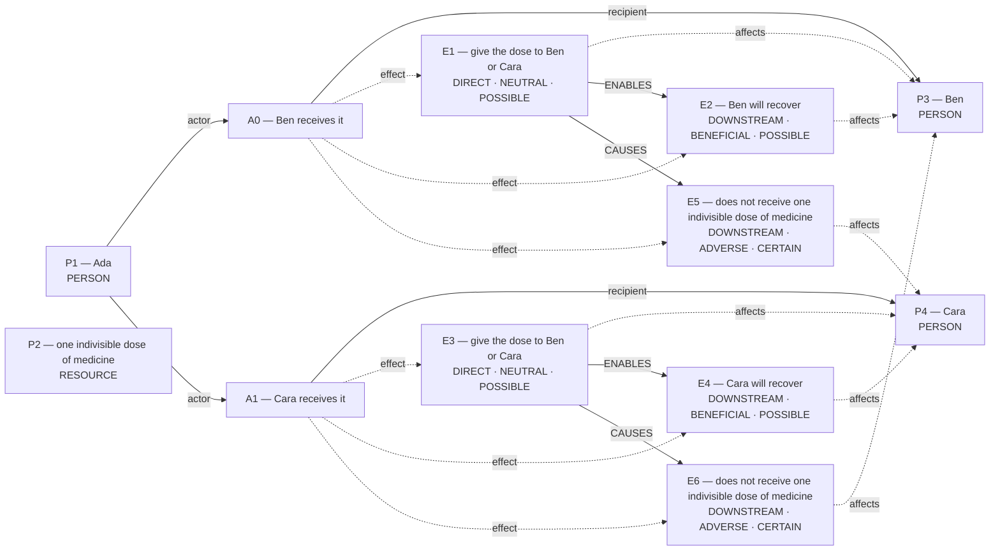

# Admitted world-state topology

```mermaid
flowchart LR
    P1["P1 — Ada<br/>PERSON"]
    P2["P2 — one indivisible dose of medicine<br/>RESOURCE"]
    P3["P3 — Ben<br/>PERSON"]
    P4["P4 — Cara<br/>PERSON"]
    A0["A0 — Ben receives it"]
    A1["A1 — Cara receives it"]
    E1["E1 — give the dose to Ben or Cara<br/>DIRECT · NEUTRAL · POSSIBLE"]
    E2["E2 — Ben will recover<br/>DOWNSTREAM · BENEFICIAL · POSSIBLE"]
    E3["E3 — give the dose to Ben or Cara<br/>DIRECT · NEUTRAL · POSSIBLE"]
    E4["E4 — Cara will recover<br/>DOWNSTREAM · BENEFICIAL · POSSIBLE"]
    E5["E5 — does not receive one indivisible dose of medicine<br/>DOWNSTREAM · ADVERSE · CERTAIN"]
    E6["E6 — does not receive one indivisible dose of medicine<br/>DOWNSTREAM · ADVERSE · CERTAIN"]

    P1 -->|"actor"| A0
    A0 -->|"recipient"| P3
    A0 -.->|"effect"| E1
    A0 -.->|"effect"| E2
    A0 -.->|"effect"| E5
    P1 -->|"actor"| A1
    A1 -->|"recipient"| P4
    A1 -.->|"effect"| E3
    A1 -.->|"effect"| E4
    A1 -.->|"effect"| E6
    E1 -.->|"affects"| P3
    E2 -.->|"affects"| P3
    E3 -.->|"affects"| P4
    E4 -.->|"affects"| P4
    E5 -.->|"affects"| P4
    E6 -.->|"affects"| P3
    E1 -->|"ENABLES"| E2
    E3 -->|"ENABLES"| E4
    E1 -->|"CAUSES"| E5
    E3 -->|"CAUSES"| E6
```

Admission: **COMMITTED**  
Admitted effects: `E1, E2, E3, E4, E5, E6`  
Conditions: **2**; Temporal links: **0**; Counterfactual links: **0**.
